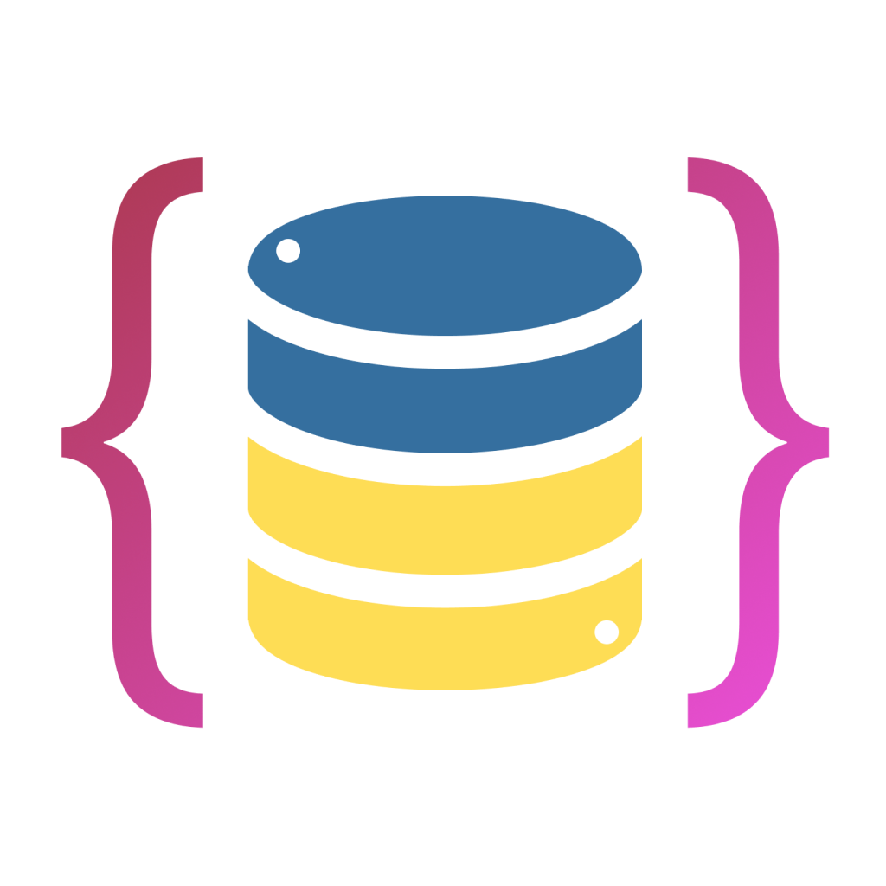

<br />
<div align="center">
  <a href="./pyjondb.png">
    
  </a>
<h3 align="center">PyJONDB</h3>
  <p align="center">
    A lightweight, encrypted JSON-based database with support for collections, document operations, and aggregation.
    <br />
    <br />
    
   
   
   

   
   
  </p>
</div>
<h2 align="center">Python JavaScript Object Notation Database <sub><sup>(without script since it sounds better)</sup></sub></h2>

This package provides a lightweight, encrypted JSON-based database with support for collections, document operations, and aggregation. It uses the cryptography library for encryption and decryption of data, ensuring secure storage of your sensitive information. The PyPI package includes docstrings for each function to make it easier to learn.


### Use pip to download the latest release
```sh
pip install pyjondb
```
### Create a user with admin role
```python
# Initialize authentication
auth = session.start()
auth.create_user('admin', 'adminpass', roles=['admin'])

# Authenticate and get a session ID
session_id = auth.authenticate('admin', 'adminpass')
if not session_id:
    raise PermissionError("Authentication failed")
```
### Initialize and create the database
```python
# Initialize the database
# The database function has optional values: 
# pyjondb.database("database", "mypassword", debug=True/False, absolute=True/False)
db = database.init("database", "mydatabasekey", auth)

# Create the database
# Note: you should only create the database if it doesn't already exist
db.create(session_id)
```
### Writing data to the database
```python
# Create a collection
db.create_collection('my_collection', session_id)

# Add a document
db.add_document('my_collection', {'name': 'example'}, session_id)

```

### Read the data
```python
# Get all documents in a collection
print(db.read_collection('my_collection', session_id))
```

### PyJONDB gets way more advanced than writing simple data. To learn more about collections, documents, aggregation, linking, and tree structures read the [docs](https://github.com/t-a-g-o/PyJONDB)


# Database Viewing Tool
In the `database-viewer` folder there is an executable which you can run along with any PyJONDB database file (.ndb extension)

#### Note: you cannot directly edit the database with the viewing tool


# License & Contact 📃
This project is published under the [MIT license](./LICENSE)

If you are interested in working together, or want to get in contact with me please email me at santiago@tago.works